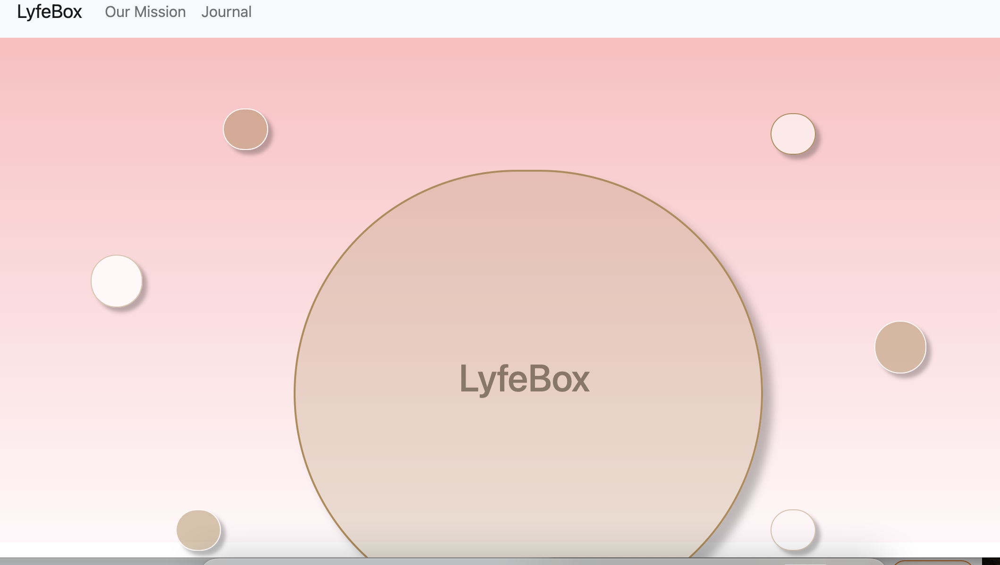
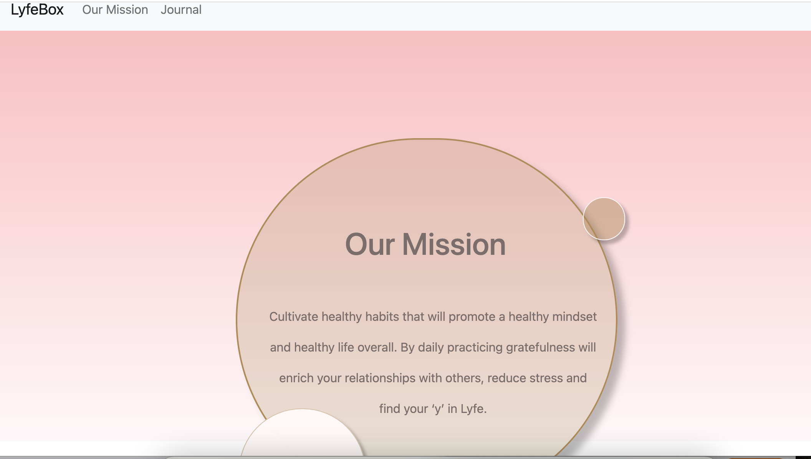

># **_LyfeBox_**
**Public Quote & Wellness Journal**:
Finding Your l'Y'fe

#### By: Janay Anguiano

#### 10/11/2021

| [Jae's GitHub](https://github.com/Jangui92) |[Jae's LinkedIn](https://www.linkedin.com/in/janay-anguiano-778717215/) |

> ## Getting Started

1. Users can navigate on LifeBox page on the site without logging in.
2. Users are able to post journalies on an open forum, delete journalies, recieve comments on their journalies. Create tips, update tips, read tips and delete tips.
3. Api generated quotes of the day that display random new quotes everytime page is refreshed.
4. A design mock up is on [Figma](https://www.figma.com/file/1yrt8dZSW4wnb2SSa1KgEh/Untitled?node-id=0%3A1).
6. If you would like to dive deeper into LyfeBox's commencement, I have provided a link to my trello. Take a look! [here](https://trello.com/b/2LHsSQdZ/lifebox).

> ## _Technologies used_

- Postres
- Express
- React
- Node

> # _Details_
>
> **_LifeBox_** is a mental wellness and journaling app that allows users to display a journal on an open site.  Users can receive generated helpful quotes to achieve a peaceful space.  An app designed to cultivate healthy habits that will promote a healthy mindset and healthy life overall. By daily practicing gratefulness will enrich your relationships with others, reduce stress and find your ‘y’ in Lyfe.

> ## _Screenshots_
>
> 

> ## _Credits_
-[Figma](https://www.figma.com/file/1yrt8dZSW4wnb2SSa1KgEh/Untitled?node-id=0%3A1)
-[Bootstrap](https://react-bootstrap.netlify.app/components/navs/)
-[Luke Peavey Quotes](https://github.com/lukePeavey/quotable)

> ## _Future Updates_

- [x] Utilize a quote of the day API
- [ ] Infuse Auth to create a safe environment for users
- [ ] Incorporate AWS S3 for users to upload photos

