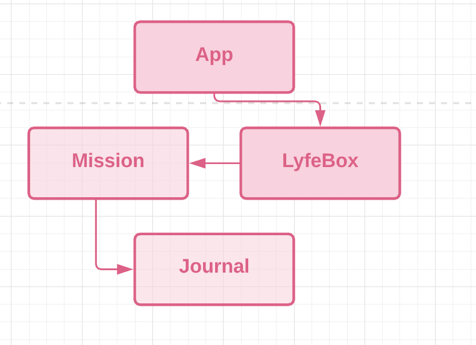
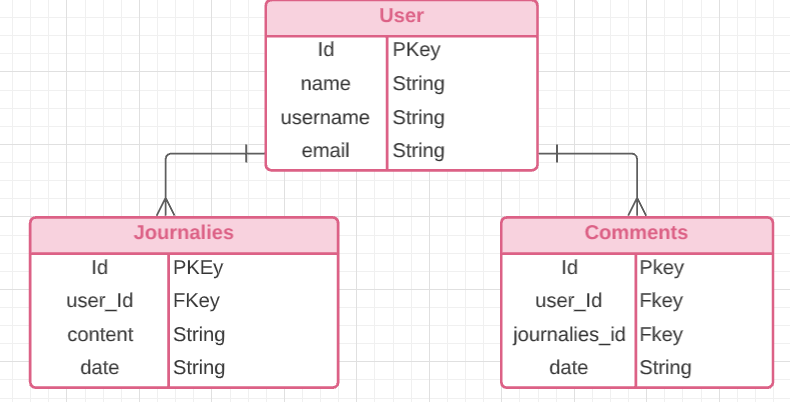

># **_LyfeBox_**
**Mental Wellness Journal**:
Finding Your l'Y'fe

#### By: Janay Anguiano

#### 10/11/2021

| [Jae's GitHub](https://github.com/Jangui92) |[Jae's LinkedIn](https://www.linkedin.com/in/janay-anguiano-778717215/) |

> ## Getting Started

1. Users can create a **Free** LifeBox page on the site.
2. Users are able to post journalies, update their mood and thought status, delete journalies, recieve comments from users and non-users on their journalies.
3. Navigation gives users access to additional quotes and tips of the day.
4. If a user wants to keep a tip of the day they can "Coinit" and it saves in their profile list.
5. A design mock up is on [Figma](https://www.figma.com/file/1yrt8dZSW4wnb2SSa1KgEh/Untitled?node-id=0%3A1).
6. If you would like to dive deeper into LyfeBox's commencement, I have provided a link to my trello. Take a look! [here](https://trello.com/b/2LHsSQdZ/lifebox).

> ## _Technologies used_

- Postres
- Express
- React
- Node

> # _Details_
>
> **_LifeBox_** is a mental wellness and journaling app that allows users to display their mood and thoughts for that day-journalies, interact on their spot about what they are grateful for and receive generated helpful wellness tips, quotes, information, or exercises to practice on a daily basis in order to achieve a peaceful space. Users can view additional quotes and gratefulness posts on their navigation tabs for an extra boost in their day. An app designed to cultivate healthy habits that will promote a healthy mindset and healthy life overall. By daily practicing gratefulness will enrich your relationships with others, reduce stress and find your ‘y’ in Lyfe.

### Client Details

Users will be able to register, login and navigate from their user profile. Users will be able to post comments under the photos posted in their profile to give more details to viewers.

> ## _Screenshots_
>
> 

> ## _Credits_
-[Figma](https://www.figma.com/file/1yrt8dZSW4wnb2SSa1KgEh/Untitled?node-id=0%3A1)
-[Bootstrap](https://react-bootstrap.netlify.app/components/navs/)

> ## _Future Updates_

- [ ] Utilize a quote of the day API
- [ ] Infuse Auth to create a safe environment for users
- [ ] Incorporate AWS S3 for users to upload photos

